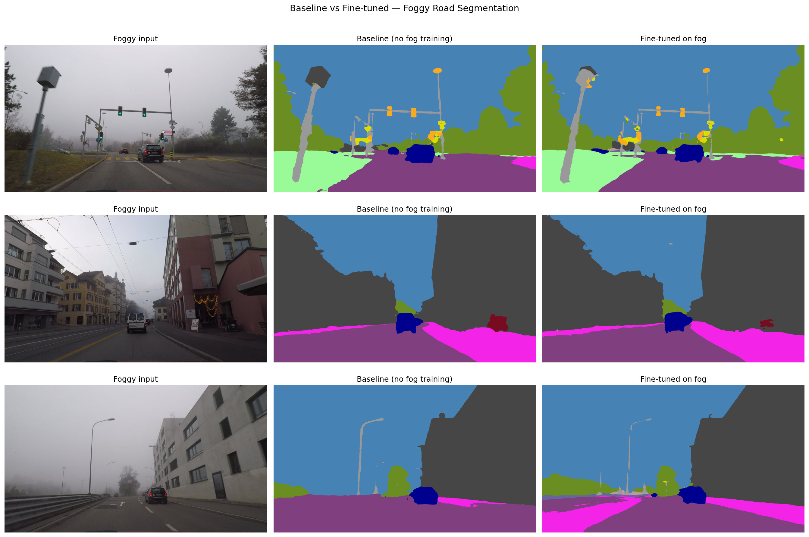
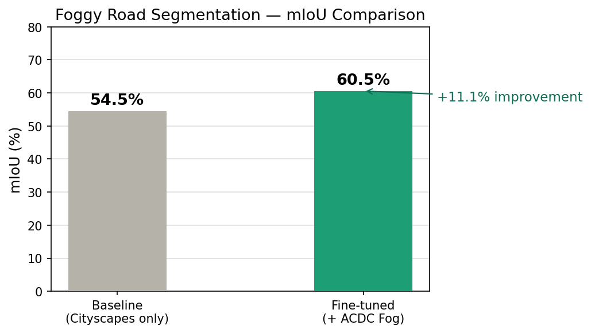

# Foggy Road Scene Segmentation

Fine-tuning SegFormer-b0 for semantic segmentation under foggy 
conditions using the ACDC adverse weather dataset.

## Results

| Model | mIoU |
|---|---|
| Baseline (Cityscapes only) | 54.5% |
| Fine-tuned (+ ACDC Fog) | 60.6% |

**+11.1% improvement** after fine-tuning on 400 foggy driving images.

## Qualitative Comparison

## mIoU Results

## What this project does

- Loads a pre-trained SegFormer-b0 model trained on Cityscapes
- Evaluates its baseline performance on foggy road scenes from ACDC
- Fine-tunes it on 400 foggy training images for 10 epochs
- Evaluates and compares mIoU before and after fine-tuning
- Visualizes segmentation predictions using the Cityscapes color map

## Dataset

[ACDC — Adverse Conditions Dataset with Correspondences](https://acdc.vision.ee.ethz.ch/)
Fog split: 400 train / 100 val images with pixel-level semantic labels.

## Model

[SegFormer-b0 fine-tuned on Cityscapes](https://huggingface.co/nvidia/segformer-b0-finetuned-cityscapes-1024-1024)
by NVIDIA, used as the baseline and starting point for fine-tuning.

## Tech Stack

- Python, PyTorch
- HuggingFace Transformers (SegFormer)
- OpenCV, Matplotlib, NumPy
- Google Colab (T4 GPU)

## How to run

1. Open `notebooks/foggy_segmentation.ipynb` in Google Colab
2. Mount your Google Drive and point paths to your ACDC dataset
3. Run all cells top to bottom